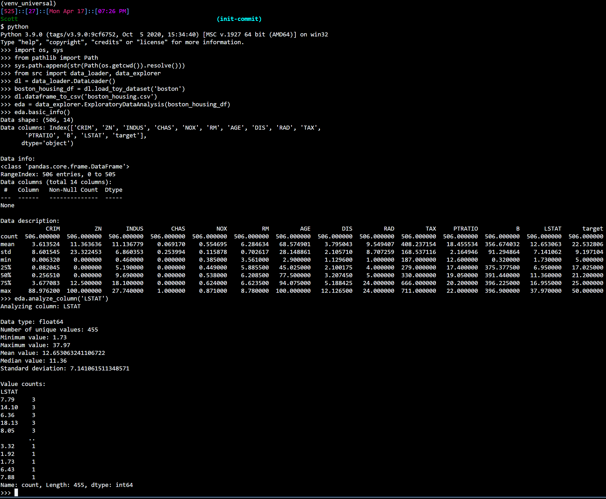

# Universal-EDA

Universal-EDA is a Python library that provides an easy-to-use interface for Exploratory Data Analysis (EDA) and data loading. It supports various datasets and helps streamline the EDA process.

## Background

This project was inspired by the process of updating the [Simple Linear Regression](https://github.com/sminerport/boston-housing-analysis) Project in scikit-learn and discovering that the Boston Housing dataset had been removed in later versions of scikit-learn. Universal-EDA aims to provide an easy way to work with various datasets, including the Boston Housing dataset, for EDA and other machine learning tasks.

## Features

- DataExplorer class: Perform EDA on any dataset, including summary statistics, missing values, and visualization
- DataLoader class: Load common datasets from scikit-learn or convert DataFrames to CSV files

## Installation

Clone the repository and install the required dependencies:

```bash
git clone https://github.com/your_username/universal-EDA.git
cd universal-EDA
pip install -r requirements.txt
```

## Usage


```python
from src import DataExplorer, DataLoader

# Load a sample dataset
data_loader = DataLoader()
df = data_loader.load_toy_dataset('boston')

# Perform EDA on the dataset
data_explorer = DataExplorer(df)
data_explorer.basic_info()

# Save the DataFrame as a CSV file
data_loader.dataframe_to_csv('boston_housing.csv')
```

Sample Python interpreter output:



## Contributing

Pull requests are welcome. For major changes, please open an issue first to discuss what you would like to change.

## License

This project is licensed under the MIT License. See the [LICENSE](LICENSE) file for more information.
